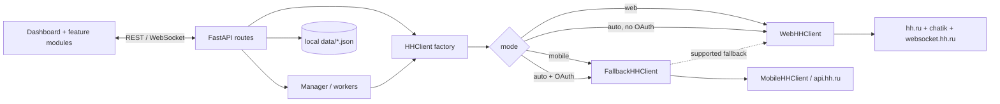
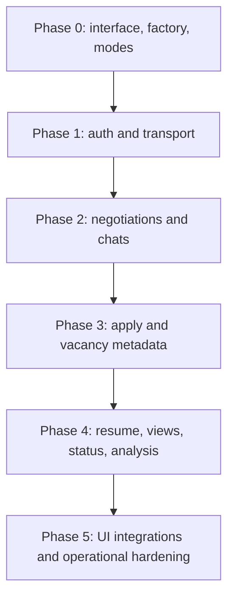
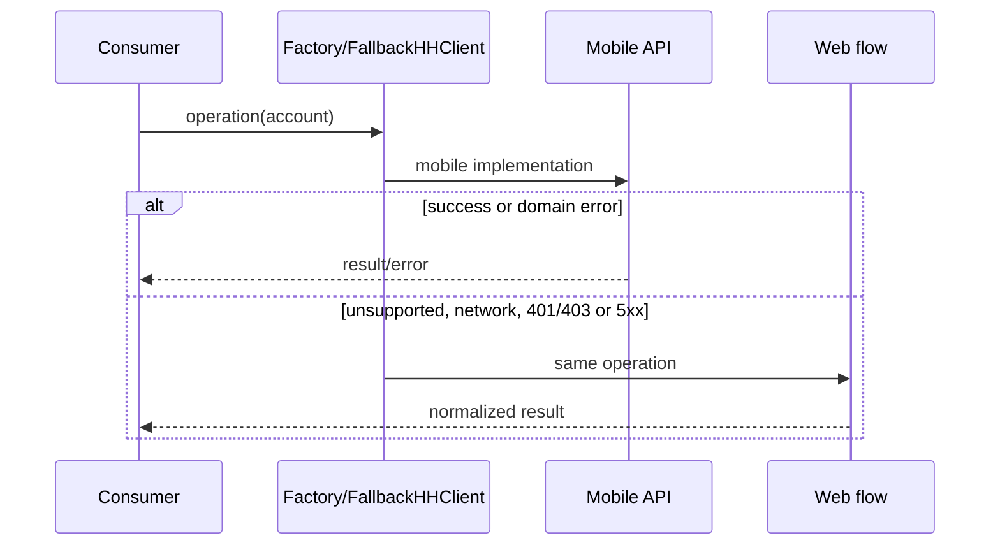

# Архитектура

## Компоненты

`HHClientBase` задаёт общий контракт. Capability-интерфейсы отделяют операции,
которые существуют только в web или mobile. Фабрика выбирает реализацию по
per-account `mode`; конфигурационный default используется лишь при отсутствии
явного значения.

## Phase 0–5

| Фаза | Результат |
|---|---|
| 0 | единый клиент, web adapter, mobile skeleton, factory и режимы |
| 1 | mobile transport, OAuth/OTP, identity и token persistence |
| 2 | переговоры, треды, сообщения, quick replies и chat actions |
| 3 | pre-flight, отклики, related vacancies и employer metadata |
| 4 | резюме, просмотры, skills, job status и анализ |
| 5 | callers/UI переведены на abstraction, realtime и fallback укреплены |

`docs/PHASE_MATRIX.md` сохраняет детальную историческую матрицу методов; этот
документ описывает итоговую систему.

## Fallback chain

Предметные ошибки (`400`, `404`, `409`) обычно возвращаются вызывающему коду и
не скрываются fallback. Web-only операции требуют живых cookies даже у
mobile-аккаунта.

## Realtime

WebSocket HH доставляет chat events, внутренний WS dashboard — snapshots и
счётчики UI. Reconnect использует backoff; polling остаётся резервом. Разрыв WS
не меняет выбранный HH client mode.

## Данные и конкурентность

`data/accounts.json`, `browser_sessions.json`, `oauth_tokens.json` и
`config.json` записываются локально, атомарно и через secure-store: DPAPI на
Windows либо AES-GCM при заданном `HH_BOT_DATA_KEY`. Plaintext legacy-файлы
мигрируют прозрачно. OAuth refresh защищён per-user lock. Исходящие web-запросы используют отдельный cookie jar на identity
аккаунта; LRU ограничивает число session jars. Полная модель угроз и удаление
данных описаны в [SECURITY.md](SECURITY.md).
